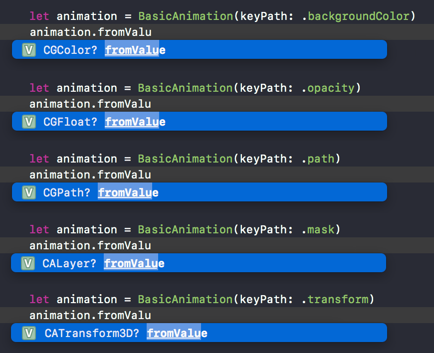
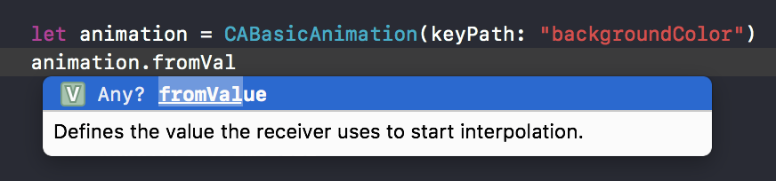
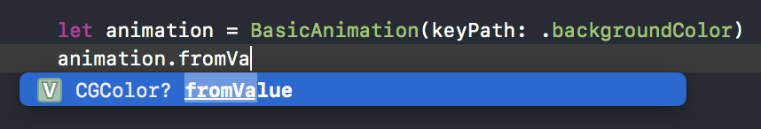

# TheAnimation

[](https://travis-ci.org/marty-suzuki/TheAnimation)
[](https://developer.apple.com/iphone/index.action)
[](https://developer.apple.com/swift)
[](https://github.com/Carthage/Carthage)
[](https://cocoapods.org/pods/TheAnimation)
[](https://cocoapods.org/pods/TheAnimation)

TheAnimation is Type-safe CAAnimation wrapper.



## Introduction

For example, if you want to animate `backgroundColor` with `CABasicAnimation`, you need to consider type because fromValue property and so on are `Any?`.



If you use `BasicAnimation of TheAnimation`, you can animate `backgroundColor` without considering type! (`AnimationKeyPaths.backgroundColor` is `AnimationKeyPath<CGColor>` type.)



## Usage

The way of making an animation is almost similar `CAAnimation`.
But you need to use `animation.animate(in:)` method instead of using `layer.add(_:forKey:)`.

```swift
let view = UIView()

let animation = BasicAnimation(keyPath: .opacity)
animation.fromValue = 0
animation.toValue   = 1
animation.duration  = 1
animation.animate(in: view)
```

`animation.animate(in:)` returns `AnimaitonCanceller`. You can cancel an animation with it.

```swift
let canceller = animation.animate(in: view)
canceller.cancelAnimation()
```

## Example

To run the example project, clone the repo, and open Example directory.

## Correspondence Table

| CAAnimation | TheAnimation |
| :-: | :-: |
| CAPropertyAnimation | PropertyAnimation |
| CABasicAnimation | BasicAnimation |
| CAKeyframeAnimation | KeyframeAnimation |
| CASpringAnimation | SpringAnimation |
| CATransition | TransitionAnimation |
| CAAnimationGroup | AnimationGroup |

## Add new `AnimationKeyPath`

You can add `AnimationKeyPath` like this.

```swift
extension AnimationKeyPaths {
    static let newKeyPath = AnimationKeyPath<CGFloat>(keyPath: "abcd")
}
```

## Requirements

- Xcode 9.3
- iOS 9 or greater

## Installation

### Carthage

If you’re using [Carthage](https://github.com/Carthage/Carthage), simply add
TheAnimation to your `Cartfile`:

```ruby
github "marty-suzuki/TheAnimation"
```

### CocoaPods

TheAnimation is available through [CocoaPods](https://cocoapods.org). To install
it, simply add the following line to your Podfile:

```ruby
pod 'TheAnimation'
```

## Author

marty-suzuki, s1180183@gmail.com

## License

TheAnimation is available under the MIT license. See the LICENSE file for more info.
